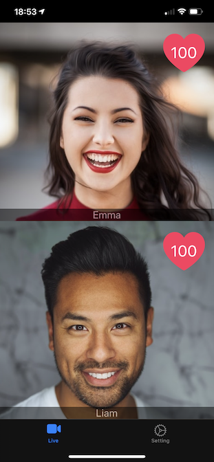
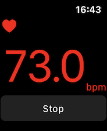

[](https://developer.apple.com/swift)
[](http://twitter.com/yorifuji)

[English](#English)

# webrtc-heartbeat

iOSで動くビデオチャットアプリのサンプルコードです、音声・映像・データ通信はWebRTCを利用しています。

Apple Watchがあれば心拍数をネットワーク経由で共有することができます。

iOSアプリとwatchOSアプリで構成されています。





動作イメージ

> [Apple Watch] < -(WCSession)- > [iOS Device] < --- Internet (WebRTC) --- > [iOS Device] < -(WCSession)- > [Apple Watch] 

WebRTCの実装は [SKyWay](https://webrtc.ecl.ntt.com/) を使っています。

## 動作環境

> iOS 13 and watchOS 6

## ビルド手順

+ リポジトリをチェックアウト
- CocoaPodsでSKyWayをインストール
```
pod install
```
- `webrtc-heartbeat.xcworkspace` を開く
- `AppDelegate.swift` にSkyWayのAPI KEYをセットします
```swift
    var skywayAPIKey = "" // xxxx-xxx-xxx-xxxx...
    var skywayDomain = "" // localhost,...
```
- build and run
    - `webrtc-hartbeat` がアプリ本体です
    - `watch-bpm-monitor` が心拍数を計測するAppleWatchアプリです

Xcode 11.5 でビルドできることを確認しています

# English

## webrtc-heartbeat

Sample code for video chat using webrtc, with Apple Watch (get heart rate).


## how-to build

- install frameworks by cocoapods
- set skyway api key in AppDelegate.swift, https://webrtc.ecl.ntt.com/
```swift
    var skywayAPIKey = "" // xxxx-xxx-xxx-xxxx...
    var skywayDomain = "" // localhost,...
```
- build and run

I have confirmed that I can build with Xcode 11.5

## Requirements

iOS 13 and watchOS 6
